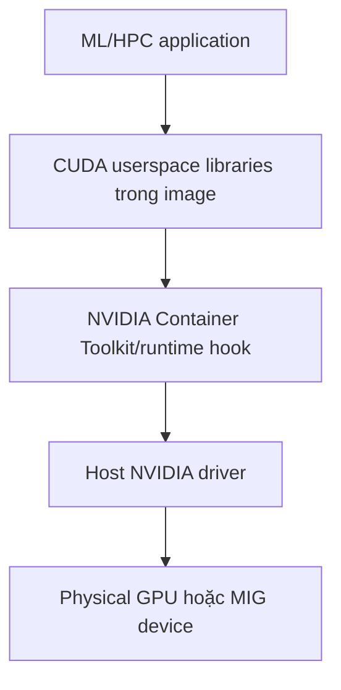

GPU container vẫn là container process dùng host kernel và host GPU driver. Image thường mang CUDA userspace libraries/framework; **host** cung cấp kernel driver và device. NVIDIA Container Toolkit nối Docker runtime với driver/device trên host.



Copy driver từ host vào image hoặc cài kernel driver trong Dockerfile là sai boundary. Image cần framework/CUDA userspace tương thích; host driver phải đáp ứng compatibility requirement.

## Prerequisites

Phần này tập trung NVIDIA CUDA trên Linux Docker Engine. Trước khi chạy container:

1. host có NVIDIA GPU được support;
2. NVIDIA driver cài bằng package/release phù hợp distro;
3. `nvidia-smi` chạy thành công trên host;
4. Docker Engine hoạt động;
5. NVIDIA Container Toolkit được cài và cấu hình cho Docker;
6. image CUDA/framework phù hợp architecture và driver compatibility.

```bash
nvidia-smi
docker version
docker info
```

Docker Desktop/platform GPU support thay đổi theo OS/backend. Windows thường cần WSL2/GPU stack được support; macOS không cung cấp NVIDIA CUDA passthrough tương đương cho Linux containers. Kiểm tra matrix hiện hành của Docker và vendor thay vì giả định `--gpus` chạy ở mọi context.

## Cấu hình NVIDIA Container Toolkit

Sau khi cài Toolkit theo repository/package instructions chính thức của NVIDIA, cấu hình Docker runtime:

```bash
sudo nvidia-ctk runtime configure --runtime=docker
sudo systemctl restart docker
```

`nvidia-ctk` sửa `/etc/docker/daemon.json`; review diff trước khi restart nếu host đã có daemon configuration:

```bash
sudo cat /etc/docker/daemon.json
docker info
```

Rootless Docker dùng config path và cgroup setup khác; theo đúng mục Rootless trong NVIDIA installation guide. Không copy rootful command rồi chạy bằng `sudo` nếu daemon thực là rootless user service.

<Callout type="warn" title="Không dùng --privileged để bật GPU">
  `--privileged` mở gần như toàn bộ device/capability boundary của host. Dùng `--gpus` hoặc CDI/device mechanism được vendor hỗ trợ và chỉ cấp đúng GPU cần thiết.
</Callout>

## Smoke test

Dùng tag CUDA cụ thể thay vì `latest`; đảm bảo tag tồn tại và phù hợp driver của host:

```bash
docker run --rm --gpus all \
  nvidia/cuda:12.9.0-base-ubuntu22.04 \
  nvidia-smi
```

Expected:

- container nhìn thấy GPU dự kiến;
- driver version phản ánh host driver;
- command exit `0`;
- không có lỗi NVML/runtime initialization.

`nvidia-smi` thành công chỉ chứng minh device/driver visibility cơ bản. Framework còn cần test riêng:

```bash
docker run --rm --gpus all FRAMEWORK_IMAGE \
  python -c 'import torch; print(torch.cuda.is_available()); print(torch.cuda.get_device_name(0))'
```

Chọn image/tag thực tế từ registry đáng tin và pin digest trong production.

## Cấp tất cả, theo số lượng hoặc theo device

Tất cả GPU:

```bash
docker run --rm --gpus all IMAGE nvidia-smi -L
```

Một GPU theo count:

```bash
docker run --rm --gpus 1 IMAGE nvidia-smi -L
```

GPU cụ thể; quote để shell không tách dấu phẩy:

```bash
docker run --rm --gpus '"device=0,2"' IMAGE nvidia-smi -L
```

Index có thể thay đổi sau reboot/reconfiguration. Với production, cân nhắc UUID hiển thị bởi `nvidia-smi -L` và mechanism scheduler/vendor hỗ trợ thay vì gắn logic lâu dài vào index.

NVIDIA runtime cũng hỗ trợ `NVIDIA_VISIBLE_DEVICES` và driver capability environment variables. Ưu tiên `--gpus`/Compose model cho allocation; chỉ dùng env nâng cao khi hiểu precedence và threat boundary.

## Compose GPU reservation

```yaml
services:
  trainer:
    image: nvidia/cuda:12.9.0-base-ubuntu22.04
    command: nvidia-smi
    deploy:
      resources:
        reservations:
          devices:
            - driver: nvidia
              count: 1
              capabilities: [gpu]
```

`capabilities: [gpu]` là bắt buộc theo Docker Compose GPU guide. `count` và `device_ids` loại trừ lẫn nhau.

Chọn device cụ thể:

```yaml
services:
  trainer:
    image: example/trainer@sha256:...
    deploy:
      resources:
        reservations:
          devices:
            - driver: nvidia
              device_ids: ["0", "3"]
              capabilities: [gpu]
```

Validate và chạy:

```bash
docker compose config
docker compose run --rm trainer
```

Support phụ thuộc Docker host, daemon/runtime và Compose version. File parse thành công không chứng minh host có GPU hoặc Toolkit đúng.

## GPU assignment không đồng nghĩa GPU isolation hoàn chỉnh

`--gpus` quyết định device nào được expose, nhưng không mặc nhiên đặt:

- GPU compute quota theo phần trăm;
- VRAM hard limit cho từng container;
- fair scheduling giữa nhiều process;
- performance/power clock policy;
- topology-aware placement;
- protection khỏi workload giữ GPU context lâu.

Nhiều container cùng thấy một GPU có thể cạnh tranh compute và memory. OOM trong CUDA allocator khác cgroup host-memory OOM; `.State.OOMKilled` có thể vẫn `false` khi framework báo `CUDA out of memory`.

Cơ chế chia sẻ phụ thuộc GPU/vendor:

- NVIDIA MIG chia một số GPU thành hardware-isolated instances;
- time-slicing/MPS có semantics và isolation khác;
- orchestrator/device plugin quản lý scheduling/allocation;
- framework có per-process memory controls nhưng không thay host governance.

Không gọi `count: 1` là “reserve toàn bộ hiệu năng của một GPU” nếu device đang được chia sẻ.

## Host memory, pinned memory và shared memory

GPU workload vẫn dùng host resources:

- CPU để preprocess/launch kernels;
- RAM cho dataset, framework và pinned buffers;
- `/dev/shm` cho multiprocessing/data loader;
- disk/network để nạp data/checkpoint;
- file descriptors và PIDs/threads.

Ví dụ baseline có cả giới hạn host resources:

```bash
docker run --rm --gpus 1 \
  --cpus 4 \
  --memory 16g \
  --pids-limit 1024 \
  --shm-size 1g \
  IMAGE COMMAND
```

Các số chỉ minh họa. `--memory` giới hạn host memory, không trực tiếp giới hạn VRAM. `--shm-size` quá nhỏ có thể làm data-loader worker lỗi; tăng mù quáng lại tăng memory-backed capacity cần quản lý.

## Compatibility và reproducibility

Pin và ghi nhận:

- host driver version;
- GPU model, compute capability và firmware khi liên quan;
- Container Toolkit/runtime version;
- image digest;
- CUDA/cuDNN/framework versions;
- architecture/platform;
- MIG mode/profile hoặc sharing mode;
- model/dataset/precision và benchmark parameters.

Lỗi `CUDA driver version is insufficient`, `no kernel image is available`, symbol mismatch hoặc framework không thấy GPU thường là compatibility issue, không phải lý do chạy privileged.

## Observability

Kiểm tra inventory và process:

```bash
nvidia-smi -L
nvidia-smi
nvidia-smi --query-gpu=uuid,name,utilization.gpu,memory.used,memory.total,temperature.gpu,power.draw \
  --format=csv
```

Kết hợp:

- GPU utilization và memory;
- per-process/container mapping;
- host CPU/RAM/I/O/network;
- framework metrics như step time, batch latency, data-loader wait;
- thermal/power throttling;
- ECC/Xid/vendor error events.

Production thường dùng NVIDIA DCGM exporter hoặc vendor-supported telemetry integration. `docker stats` không cung cấp đầy đủ GPU utilization/VRAM metrics.

## Troubleshooting theo thứ tự

1. `nvidia-smi` trên host — driver/device có hoạt động không?
2. `docker info` và Toolkit config — daemon dùng đúng runtime/config không?
3. Smoke-test CUDA image tối giản — device injection có hoạt động không?
4. `nvidia-smi -L` trong application image — image có tool/library cần không?
5. Framework probe — CUDA available, device name và library load.
6. Kiểm tra image/driver compatibility và architecture.
7. Kiểm tra device selection, MIG/sharing mode và permissions.
8. Kiểm tra host memory, `/dev/shm`, PIDs, disk/network nếu job treo/chậm.
9. Thu logs/version inventory trước khi restart daemon hoặc đổi driver.

## Nguồn chính thức

- [GPU access — Docker Docs](https://docs.docker.com/engine/containers/resource_constraints/#gpu)
- [Run Compose services with GPU access](https://docs.docker.com/compose/how-tos/gpu-support/)
- [Install NVIDIA Container Toolkit](https://docs.nvidia.com/datacenter/cloud-native/container-toolkit/latest/install-guide.html)
- [NVIDIA Container Toolkit: Docker configuration](https://docs.nvidia.com/datacenter/cloud-native/container-toolkit/latest/docker-specialized.html)
