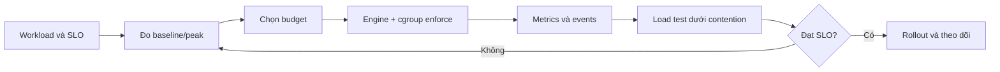

Container không tự có CPU, memory hay I/O quota chỉ vì đã được cách ly. Trên Linux, Docker đặt các process của container vào **control groups (cgroups)** để kernel account, ưu tiên và giới hạn tài nguyên. Namespace quyết định process nhìn thấy gì; cgroup quyết định nhóm process được dùng bao nhiêu và cạnh tranh ra sao.

Phần này chuyển từ cơ chế cgroup đã trình bày ở [Control groups](/docs/nen-tang-container/control-groups/) sang công việc vận hành: chọn limit, xác minh effective configuration, phát hiện throttling/OOM và tối ưu dựa trên measurement.



## Bốn loại control không được nhầm lẫn

| Loại | Ví dụ | Ý nghĩa | Không bảo đảm |
|---|---|---|---|
| Hard ceiling | `--memory 512m`, `--cpus 1.5`, `--pids-limit 256` | Chặn usage theo semantics của controller | Workload luôn nhận đủ lượng đó |
| Relative weight | `--cpu-shares`, `--blkio-weight` | Tăng/giảm phần được chia khi có contention | Trần tuyệt đối hoặc reservation |
| Affinity | `--cpuset-cpus 2-3` | Chỉ cho process chạy trên tập CPU cụ thể | CPU time trong tập đó |
| Soft threshold/reservation | `--memory-reservation 384m` hoặc reservation của orchestrator | Tín hiệu reclaim/scheduling tùy platform | Hard memory boundary |

Một cấu hình có thể kết hợp nhiều loại. Ví dụ `--cpus 1 --cpu-shares 512` vừa đặt ceiling một CPU time, vừa giảm weight so với peer khi cả hai cùng bị contention trong hierarchy liên quan.

<Callout type="warn" title="Limit không phải capacity">
  `--memory 512m` không tạo thêm 512 MiB và `--cpus 2` không reserve hai core vật lý. Container còn bị giới hạn bởi tài nguyên host, Docker Desktop VM, parent cgroup, cpuset và workload khác.
</Callout>

## Resource boundary nằm ở đâu?

```text
physical host hoặc cloud VM
└── systemd slice / Docker Desktop Linux VM
    └── Docker daemon và parent cgroup
        └── container cgroup
            ├── PID 1
            └── child processes / threads
```

Effective budget là giao của nhiều boundary:

- capacity của host hoặc VM chạy daemon;
- limit của parent systemd slice/cgroup;
- limit trên container;
- process-level rlimits (`ulimit`);
- application runtime settings như JVM heap, worker count hoặc connection pool;
- device, filesystem, network và external-service capacity.

Trên macOS/Windows khi chạy Linux containers, CPU và memory trước hết được cấp cho Linux VM của Docker Desktop. `docker stats` nhìn từ daemon trong VM; Activity Monitor hoặc Task Manager nhìn process/VM ở host. Hai view không nhất thiết cộng khớp 1:1.

## Kiểm tra platform trước khi đặt limit

```bash
docker context show
docker version
docker info --format \
  'OSType={{.OSType}} CgroupVersion={{.CgroupVersion}} CgroupDriver={{.CgroupDriver}} CPUs={{.NCPU}} Memory={{.MemTotal}}'
```

Xem warning ở cuối `docker info` nếu kernel không hỗ trợ swap accounting, CPU quota hoặc controller cần thiết:

```bash
docker info 2>&1 | tail -n 20
```

Với rootless Docker, resource control đầy đủ thường cần cgroup v2 và systemd delegation phù hợp. Đọc [Rootless security](/docs/security/rootless-security/) và kiểm tra effective config thay vì giả định flag được enforce.

## Baseline container có giới hạn

Ví dụ sau tạo một workload lab không publish port và không ghi dữ liệu bền vững:

```bash
docker run --detach \
  --name resource-baseline \
  --label com.example.lab=resources \
  --memory 256m \
  --memory-reservation 192m \
  --cpus 0.75 \
  --pids-limit 128 \
  alpine:3.23 sleep 600
```

Xác minh cấu hình Engine đã lưu:

```bash
docker inspect resource-baseline --format '{{json .HostConfig}}' |
  jq '{Memory, MemoryReservation, MemorySwap, NanoCpus, CpuShares, CpusetCpus, PidsLimit}'
```

Quan sát một snapshot runtime:

```bash
docker stats --no-stream resource-baseline
```

Trong container cgroup v2, các file sau cho view trực tiếp từ kernel:

```bash
docker exec resource-baseline sh -c '
  for f in memory.current memory.max memory.events cpu.max cpu.stat pids.current pids.max; do
    [ -r "/sys/fs/cgroup/$f" ] && { echo "--- $f"; cat "/sys/fs/cgroup/$f"; }
  done
'
```

Path và file khác trên cgroup v1. Không hard-code collector v2 nếu fleet còn host v1.

Cleanup:

```bash
docker rm --force resource-baseline
```

## Từ SLO tới resource budget

Không chọn limit bằng cách lấy usage trung bình rồi cộng một tỷ lệ tùy ý. Quy trình nên gồm:

1. **Định nghĩa workload:** request mix, concurrency, dataset, startup và batch jobs.
2. **Định nghĩa SLO:** throughput, p95/p99 latency, error rate và thời gian recovery.
3. **Đo baseline:** application metrics cùng CPU, memory, I/O, network và PIDs.
4. **Tách phase:** startup spike, warm steady state, peak hợp lệ và failure/retry storm.
5. **Chọn boundary:** hard limit để bảo vệ host; weight/reservation để xử lý contention.
6. **Load test dưới contention:** không chỉ test container chạy một mình trên laptop.
7. **Quan sát failure mode:** CPU throttle, reclaim/swap, OOM, `fork` failure và I/O queue.
8. **Rollout từng phần:** alert và rollback dựa trên SLO, không chỉ CPU percentage.

Resource budget phải được version-control cùng deployment config. Thay đổi limit là thay đổi behavior production và cần review như thay code.

## Signal nào trả lời câu hỏi nào?

| Câu hỏi | Evidence chính |
|---|---|
| Container được cấu hình limit gì? | `docker inspect ... .HostConfig` |
| Hiện tại dùng bao nhiêu? | `docker stats`, cgroup files, monitoring backend |
| CPU có bị throttle? | `cpu.stat`, latency/throughput, host scheduler metrics |
| Có OOM kill không? | `.State.OOMKilled`, `memory.events`, Docker/kernel events |
| Không tạo được process/thread vì sao? | `pids.current`, `pids.max`, rlimits và application error |
| I/O chậm ở layer nào? | cgroup `io.stat`, device latency/queue, filesystem và backend metrics |
| Limit có làm SLO xấu đi? | Benchmark/load test và application telemetry |

Một counter tích lũy cho biết sự kiện đã từng xảy ra; rate tăng trong cửa sổ thời gian mới cho biết vấn đề đang diễn ra. Một snapshot `docker stats` không thay thế time series.

## Lộ trình phần này

1. [CPU limits và reservations](/docs/tai-nguyen-va-hieu-nang/cpu-limits/) — quota, shares, cpuset và throttling.
2. [Memory limits và OOM](/docs/tai-nguyen-va-hieu-nang/memory-limits/) — hard/soft limit, swap, reclaim và điều tra OOM.
3. [Block I/O controls](/docs/tai-nguyen-va-hieu-nang/block-io/) — weight, bandwidth, IOPS và storage topology.
4. [PID limits](/docs/tai-nguyen-va-hieu-nang/pids-limit/) và [ulimits](/docs/tai-nguyen-va-hieu-nang/ulimits/) — cgroup task count so với process rlimits.
5. [GPU containers](/docs/tai-nguyen-va-hieu-nang/gpu/) — device/runtime setup và GPU observability.
6. [Theo dõi tài nguyên](/docs/tai-nguyen-va-hieu-nang/resource-monitoring/) — từ CLI snapshot tới time series và alert.
7. [Profiling hiệu năng](/docs/tai-nguyen-va-hieu-nang/performance-profiling/) và [Tối ưu hiệu năng Docker](/docs/tai-nguyen-va-hieu-nang/performance-tuning/) — tìm bottleneck rồi thay đổi có kiểm chứng.

## Nguồn chính thức

- [Resource constraints — Docker Docs](https://docs.docker.com/engine/containers/resource_constraints/)
- [Runtime metrics — Docker Docs](https://docs.docker.com/engine/containers/runmetrics/)
- [Control Group v2 — Linux kernel documentation](https://docs.kernel.org/admin-guide/cgroup-v2.html)
- [Docker Desktop resource settings](https://docs.docker.com/desktop/settings-and-maintenance/settings/)
