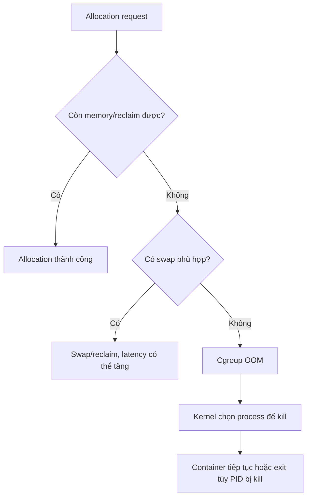

Memory limit bảo vệ host khỏi một workload dùng không kiểm soát, nhưng limit quá thấp biến peak hợp lệ thành outage. Kernel còn account nhiều loại memory ngoài heap application: anonymous pages, page cache, tmpfs, kernel memory liên quan và shared-page accounting theo semantics của cgroup/kernel.

Vì vậy, không lấy mỗi heap metric hoặc RSS của một process làm toàn bộ container budget.

## Các option chính

| Option | Vai trò | Semantics quan trọng |
|---|---|---|
| `--memory`, `-m` | Hard memory limit | Giá trị tối thiểu Docker cho phép là `6m` |
| `--memory-reservation` | Soft limit | Có tác dụng dưới contention; phải thấp hơn hard limit để có ý nghĩa cùng `--memory` |
| `--memory-swap` | Tổng memory + swap | Chỉ có nghĩa khi đặt `--memory` |
| `--memory-swappiness` | Mức cho phép swap anonymous pages | `0` giảm/không swap anonymous pages; mặc định kế thừa host tùy platform |
| `--oom-kill-disable` | Thay đổi OOM handling | Rủi ro cao; bị bỏ qua trên cgroup v2 theo Docker runtime metrics docs |
| `--oom-score-adj` | Điều chỉnh ưu tiên OOM phía host | Không dùng extreme negative để né safeguard |

Baseline:

```bash
docker run --detach \
  --name memory-baseline \
  --memory 512m \
  --memory-reservation 384m \
  alpine:3.23 sleep 600
```

Inspect byte values mà Engine lưu:

```bash
docker inspect memory-baseline --format '{{json .HostConfig}}' |
  jq '{Memory, MemoryReservation, MemorySwap, MemorySwappiness, OomKillDisable, OomScoreAdj}'
```

Cleanup:

```bash
docker rm --force memory-baseline
```

## Hard limit, soft limit và application budget

Ba con số thường cần tách:

1. **Application target:** heap/cache/worker settings mà application tự điều khiển.
2. **Soft threshold:** vùng bắt đầu reclaim/pressure hoặc reservation theo platform.
3. **Hard cgroup limit:** boundary cuối bảo vệ host và workload khác.

Ví dụ JVM heap đặt đúng bằng `--memory 512m` thường không an toàn vì JVM còn cần metaspace, code cache, thread stacks, direct buffers và native libraries. Tương tự, database buffer pool không phải toàn bộ memory footprint.

<Callout type="warn" title="Không đặt heap bằng hard limit">
  Chừa headroom cho native memory, thread stacks, page cache, runtime và startup spike. Đo dưới workload đại diện; không dùng một tỷ lệ mặc định cho mọi language/runtime.
</Callout>

## Swap semantics

Giả sử `--memory 300m`:

| Cấu hình | Kết quả theo Docker docs |
|---|---|
| Không đặt `--memory-swap` | Có thể dùng thêm swap tới lượng bằng memory limit nếu host có swap/support, tổng tối đa thường 600 MiB |
| `--memory-swap 1g` | Tối đa 300 MiB memory + khoảng 700 MiB swap |
| `--memory-swap 300m` | Memory và tổng memory+swap bằng nhau, tức không có swap allowance |
| `--memory-swap -1` | Swap không giới hạn trong phần host còn có |
| `--memory-swap 0` | Bị coi như unset |

Ví dụ không cho swap:

```bash
docker run --detach \
  --name memory-noswap \
  --memory 256m \
  --memory-swap 256m \
  alpine:3.23 sleep 600
```

`free` trong container có thể hiển thị swap của host thay vì allowance thực của cgroup. Dùng Engine config và cgroup files làm evidence.

Swap có thể hấp thụ burst nhưng làm latency tăng mạnh. Với database/latency-sensitive workload, quyết định swap phải dựa trên benchmark và host policy, không chỉ “bật để tránh OOM”.

```bash
docker rm --force memory-noswap
```

## Reclaim, pressure và OOM

Khi usage tăng, kernel có thể reclaim file cache hoặc swap pages nếu được phép. Nếu cgroup không thể thỏa allocation dưới hard boundary, OOM handling có thể chọn một hoặc nhiều process trong cgroup để kill.



Nếu PID 1 bị kill, container thường exit. Nếu worker con bị kill nhưng PID 1 vẫn sống, container có thể vẫn `running` trong trạng thái suy giảm. Health/application metrics phải phát hiện trường hợp này.

## Lab OOM có kiểm soát

Chỉ chạy trên môi trường lab. Hard limit `64m` giữ blast radius nhỏ:

```bash
docker run --name memory-oom --memory 64m --memory-swap 64m \
  python:3.13-alpine \
  python -c 'chunks=[]
while True:
    chunks.append(bytearray(1024 * 1024))'
```

Command dự kiến kết thúc khi allocation vượt boundary. Thu evidence trước khi xóa:

```bash
docker inspect memory-oom --format \
  'status={{.State.Status}} exit={{.State.ExitCode}} oom={{.State.OOMKilled}} error={{.State.Error}}'

docker events --since '10m' --until '0s' --filter container=memory-oom
```

Trên cgroup v2, cgroup có thể đã bị cleanup sau khi container dừng. Với workload đang chạy hoặc collector host, theo dõi `memory.events` liên tục để giữ counters:

```text
low ...
high ...
max ...
oom ...
oom_kill ...
```

Cleanup:

```bash
docker rm memory-oom
```

## Exit code 137 không chứng minh OOM

`137 = 128 + 9` thường cho biết process kết thúc bởi `SIGKILL`. Signal này có thể đến từ:

- cgroup/host OOM handling;
- `docker kill` mặc định;
- `docker stop` hết grace period rồi escalation;
- orchestrator hoặc operator;
- host shutdown/runtime failure.

Chỉ kết luận OOM khi có thêm evidence:

```bash
docker inspect CONTAINER --format \
  'exit={{.State.ExitCode}} oom={{.State.OOMKilled}} started={{.State.StartedAt}} finished={{.State.FinishedAt}}'

docker logs --timestamps --tail 200 CONTAINER
docker events --since '30m' --until '0s' --filter container=CONTAINER
```

Kết hợp `memory.events`, daemon logs và kernel journal nếu có quyền:

```bash
journalctl -k --since '-30 min' | grep -i -E 'oom|out of memory|killed process'
```

Docker events không phải audit log bền vững. Monitoring phải thu OOM/event signal ra hệ thống ngoài trước khi container/cgroup bị xóa.

## Đọc memory trên cgroup v2

Với container đang chạy:

```bash
docker exec CONTAINER sh -c '
  for f in memory.current memory.max memory.high memory.events memory.stat memory.pressure; do
    [ -r "/sys/fs/cgroup/$f" ] && { echo "--- $f"; cat "/sys/fs/cgroup/$f"; }
  done
'
```

| File | Câu hỏi |
|---|---|
| `memory.current` | Cgroup hiện bị charge bao nhiêu? |
| `memory.max` | Hard boundary là gì? |
| `memory.high` | Reclaim/throttle threshold ở cgroup hierarchy là gì? |
| `memory.events` | Đã chạm high/max, OOM hoặc OOM kill bao nhiêu lần? |
| `memory.stat` | Memory đang nằm ở anon, file cache và nhóm khác ra sao? |
| `memory.pressure` | Có stall do memory pressure theo PSI không? |

`docker stats` trên Linux trừ một phần cache khỏi memory usage hiển thị ở CLI; Engine API trả total usage và cache fields để client tự tính. Do đó CLI, API, cgroup và application dashboard có thể lệch dù đều đúng theo định nghĩa riêng.

## Memory leak hay working set hợp lệ?

Không kết luận leak chỉ vì graph tăng. Kiểm tra:

- usage có plateau sau warm-up không;
- heap live set sau GC có tăng qua nhiều chu kỳ không;
- file cache tăng vì dataset đọc lớn hay anonymous memory tăng;
- traffic/concurrency có đổi không;
- object, goroutine/thread, connection và queue count;
- memory có giảm sau workload hoặc reclaim không;
- release/version nào bắt đầu thay đổi slope.

Dùng application profiler để tìm allocation/retention; cgroup metrics chỉ cho biết pressure và boundary.

## Compose

Standalone Compose có các field resource trực tiếp:

```yaml
services:
  api:
    image: example/api:1.4.2
    mem_limit: 512m
    mem_reservation: 384m
    memswap_limit: 512m
```

Một số deployment model dùng:

```yaml
services:
  api:
    image: example/api:1.4.2
    deploy:
      resources:
        limits:
          memory: 512m
        reservations:
          memory: 384m
```

Support và semantics của `deploy` phụ thuộc Compose/platform. Validate cả canonical model lẫn container effective config:

```bash
docker compose config
docker compose up --detach
docker compose ps --quiet api | xargs docker inspect --format \
  'Memory={{.HostConfig.Memory}} Reservation={{.HostConfig.MemoryReservation}} Swap={{.HostConfig.MemorySwap}}'
```

## Sizing và alert

Một quy trình thực tế:

1. đo peak working set theo request mix và dataset đại diện;
2. tách startup/migration/batch spike khỏi steady state;
3. cấu hình runtime heap/cache thấp hơn cgroup hard limit;
4. load test cùng peer để tạo memory contention;
5. theo dõi memory pressure, reclaim/swap latency và OOM counters;
6. alert trước hard boundary bằng cả tỷ lệ và tốc độ tăng;
7. kiểm tra host memory, không chỉ từng container;
8. rollout và so sánh theo release.

Alert `memory > 90%` đơn lẻ dễ nhiễu với workload dùng cache chủ động. Kết hợp time-to-limit, `memory.events`, PSI, OOM, latency, GC và host available memory.

## Không tắt OOM killer như giải pháp mặc định

Docker cảnh báo chỉ dùng `--oom-kill-disable` cùng hard memory limit; runtime metrics docs cũng nêu flag bị discard trên cgroup v2. Tắt OOM handling có thể làm process treo vì allocation không tiến triển hoặc chuyển pressure lên host.

Thay vào đó:

- sửa leak hoặc queue không giới hạn;
- đặt application budget và backpressure;
- giảm concurrency/worker;
- tăng memory sau khi capacity test;
- restart có kiểm soát chỉ như mitigation, không che root cause.

## Nguồn chính thức

- [Resource constraints: Memory — Docker Docs](https://docs.docker.com/engine/containers/resource_constraints/#memory)
- [Runtime metrics — Docker Docs](https://docs.docker.com/engine/containers/runmetrics/)
- [`docker container stats`](https://docs.docker.com/reference/cli/docker/container/stats/)
- [Cgroup v2 memory controller](https://docs.kernel.org/admin-guide/cgroup-v2.html#memory)
