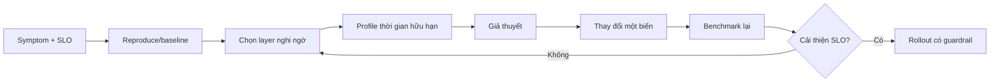

Profiling trả lời **thời gian hoặc tài nguyên đang bị tiêu ở đâu trong code/runtime/system**. Monitoring cho biết “khi nào và mức độ”; profiler giúp tìm call stack, allocation site, lock hoặc syscall gây ra nó.

Không bắt đầu bằng tool yêu thích. Bắt đầu bằng symptom, workload tái lập và giả thuyết có thể bác bỏ.



## Monitoring, tracing và profiling

| Kỹ thuật | Câu hỏi chính | Overhead/phạm vi |
|---|---|---|
| Metrics | Bao nhiêu, từ khi nào? | Thấp, liên tục |
| Logs/events | Sự kiện gì đã xảy ra? | Phụ thuộc volume/detail |
| Distributed tracing | Request đi qua service nào và chậm ở span nào? | Sampling/instrumentation |
| CPU profile | CPU time nằm ở function/stack nào? | Sampling overhead |
| Allocation/heap profile | Ai allocate/retain memory? | Runtime/tool-specific |
| Mutex/block profile | Goroutine/thread chờ lock/block ở đâu? | Có thể cần bật trước |
| Syscall trace | Process gọi syscall nào và mất thời gian ở đâu? | Có thể cao, output lớn |
| eBPF/perf | Kernel/user stacks, scheduler, I/O/network | Cần host support/quyền/symbols |

Dùng profiler ứng dụng trước khi mở rộng quyền host nếu runtime đã có tool tốt: Go `pprof`, Java JFR/async-profiler, Python `cProfile`/py-spy, Node.js inspector/CPU profile, .NET diagnostics.

## Chuẩn bị experiment

Ghi lại tối thiểu:

- image digest và command/config;
- host/VM CPU, memory, kernel, cgroup version;
- resource limits/cpuset;
- dataset, request mix, concurrency và warm-up;
- duration, số lần lặp và load generator;
- dependency/network locality;
- profiler/tool version và sampling frequency;
- metrics SLO trước/trong/sau profile.

Nếu profile build A trên laptop rồi so với build B trên shared CI runner, khác biệt môi trường có thể lớn hơn thay đổi code.

## Xác định layer trước

| Symptom | Kiểm tra trước | Profiler tiếp theo |
|---|---|---|
| CPU cao, throughput thấp | quota/throttling, single-core, GC | CPU flame graph/runtime profile |
| CPU thấp, latency cao | I/O, lock, queue, downstream | tracing, block/mutex, syscall profile |
| Memory tăng | cgroup memory, heap/anon/cache | heap/allocation profile |
| Exit/OOM | OOM evidence, memory events | heap/native-memory profile trước lần kill |
| I/O latency | app fsync/query, cgroup/device/backend | block trace, DB/storage profiler |
| Nhiều context switch | threads/run queue/lock | scheduler/perf profile |
| Network chậm | DNS/TCP/retransmit/downstream spans | packet/eBPF trace có filter |

CPU % cao không phải lỗi nếu workload hoàn thành nhanh và đạt SLO. Tối ưu metric phải gắn mục tiêu.

## Lab CPU profile không cần đặc quyền

Python built-in `cProfile` minh họa profiler ở application layer:

```bash
docker run --rm python:3.13-alpine python -c '
import cProfile
import pstats

def workload():
    return sum(i * i for i in range(5_000_000))

profiler = cProfile.Profile()
profiler.enable()
result = workload()
profiler.disable()
print("result=", result)
pstats.Stats(profiler).sort_stats("cumulative").print_stats(12)
'
```

Kết quả xếp function theo cumulative time. Lab này không đại diện production benchmark; nó cho thấy nguyên tắc **profile đúng runtime trước**, không cần `--privileged`.

Với service dài hạn, expose profiling endpoint chỉ trên management network/authentication phù hợp và giới hạn thời gian capture. Profile có thể chứa function names, URL/query fragments hoặc dữ liệu nhạy cảm tùy runtime.

## Profiling trong image tối giản

Không cài compiler/debugger bằng `docker exec` vào production container rồi để drift. Các lựa chọn:

1. application có endpoint/profile agent tích hợp từ build;
2. build debug image/target cùng source và symbols;
3. dùng ephemeral tool container join namespace của target;
4. profile từ host theo runbook có kiểm soát.

Một tool container có thể join PID namespace:

```bash
docker run --rm --interactive --tty \
  --pid=container:TARGET \
  --cap-add SYS_PTRACE \
  TOOL_IMAGE
```

Tùy tool/kernel, còn cần seccomp/LSM exception. Không mặc định thêm `--security-opt seccomp=unconfined`; nếu bắt buộc, ghi rõ thời hạn, host, operator và thu hồi sau incident. `SYS_PTRACE` có thể đọc memory/credential của target.

Đọc [Debug minimal images](/docs/observability-va-troubleshooting/debug-minimal-images/) và [Linux capabilities](/docs/security/linux-capabilities/).

## CPU profiling

Ưu tiên sampling profile để giảm observer effect. Phân biệt:

- **on-CPU:** stack đang thực thi;
- **off-CPU:** stack đang ngủ/chờ lock/I/O;
- **user time:** code userspace;
- **system time:** kernel làm việc thay process;
- **throttled time:** không chạy vì quota, không hiện như function CPU time.

Một CPU flame graph rộng ở function nào cho biết tỷ trọng sample, không tự cho biết function “chậm” theo wall time. Nếu process bị throttle nặng, profile on-CPU có thể đúng nhưng nới quota hoặc giảm work mới là giả thuyết cần test.

Checklist:

```bash
docker stats --no-stream TARGET
docker inspect TARGET --format \
  'cpus={{.HostConfig.NanoCpus}} cpuset={{.HostConfig.CpusetCpus}} memory={{.HostConfig.Memory}}'
docker exec TARGET cat /sys/fs/cgroup/cpu.stat 2>/dev/null || true
```

Sau đó mới capture runtime/perf profile trong cửa sổ symptom.

## Memory profiling

Tách:

- live heap sau GC;
- allocation rate/churn;
- native memory;
- thread stacks;
- memory-mapped files;
- page cache/tmpfs;
- GPU memory nếu là CUDA workload.

Heap profile không giải thích page cache; `docker stats` không chỉ ra object retention. Correlate runtime heap/GC với `memory.current`, `memory.stat`, OOM events và traffic.

Khi hard limit kill process quá nhanh để capture, dùng một trong các cách có kiểm soát:

- alert/profile trước threshold;
- canary có limit lớn hơn trên host đủ capacity;
- offline replay workload;
- runtime continuous profiler;
- heap dump theo trigger, kèm disk/security budget.

Heap/core dump có thể chứa secret và dữ liệu khách hàng. Xử lý như sensitive artifact.

## Syscall và kernel profiling

`strace -c` cho tổng số/thời gian syscall; `strace -ttT` cho timeline nhưng output rất lớn. `perf`/eBPF có thể quan sát scheduler, block I/O, TCP và stack trên host.

Rủi ro:

- ptrace/eBPF/perf cần capability hoặc host sysctl phù hợp;
- seccomp/AppArmor/SELinux có thể chặn;
- symbol thiếu làm stack khó đọc;
- sampling quá dày tăng overhead;
- attach sai PID/container tạo dữ liệu sai hoặc lộ thông tin;
- kernel/tool version mismatch.

Luôn filter PID/cgroup/time window, ghi overhead và thử trên staging trước.

## I/O và network profiling

I/O chậm cần correlation nhiều layer:

```text
application query/fsync
  -> filesystem/page cache
  -> cgroup I/O
  -> block device hoặc network volume
  -> storage backend
```

Network:

```text
request span
  -> DNS/connect/TLS/application wait
  -> container interface
  -> bridge/NAT/host firewall
  -> network path/downstream
```

Đừng capture full packet payload mặc định. Ưu tiên metadata/counter/headers đã kiểm soát; packet capture có thể chứa credential và PII.

## Benchmark trước và sau

Một kết quả đáng tin cần:

- cùng image inputs ngoại trừ thay đổi đang test;
- warm-up và steady-state rõ;
- nhiều lần lặp, báo phân phối/variance;
- cùng resource limits và host topology;
- load generator không phải bottleneck;
- kiểm tra correctness, không chỉ tốc độ;
- đo p95/p99, throughput, errors và resource cost;
- profile overhead không nằm trong con số final nếu production không bật nó.

Thay đổi một biến mỗi experiment. “Tối ưu Dockerfile, đổi database pool và tăng CPU cùng lúc” không cho biết yếu tố nào có hiệu quả.

## Runbook profiling production

1. Xác nhận incident/SLO và time window.
2. Capture release, container ID, limits, host và baseline metrics.
3. Chọn canary/replica; tránh profile toàn fleet.
4. Chọn tool ít quyền/overhead nhất trả lời được giả thuyết.
5. Đặt duration, sampling rate, output size và abort condition.
6. Ghi audit cho capability/namespace/security exception.
7. Capture profile cùng metrics/traces.
8. Thu hồi tool container/quyền và bảo vệ artifact.
9. Phân tích offline, tạo thay đổi nhỏ.
10. Benchmark, canary và rollback nếu SLO xấu.

## Nguồn chính thức

- [Runtime metrics — Docker Docs](https://docs.docker.com/engine/containers/runmetrics/)
- [`docker container run`: PID namespace debugging](https://docs.docker.com/reference/cli/docker/container/run/#pid-settings---pid)
- [Docker Debug](https://docs.docker.com/reference/cli/docker/debug/)
- [Linux perf security](https://docs.kernel.org/admin-guide/perf-security.html)
- [BPF documentation](https://docs.kernel.org/bpf/)
