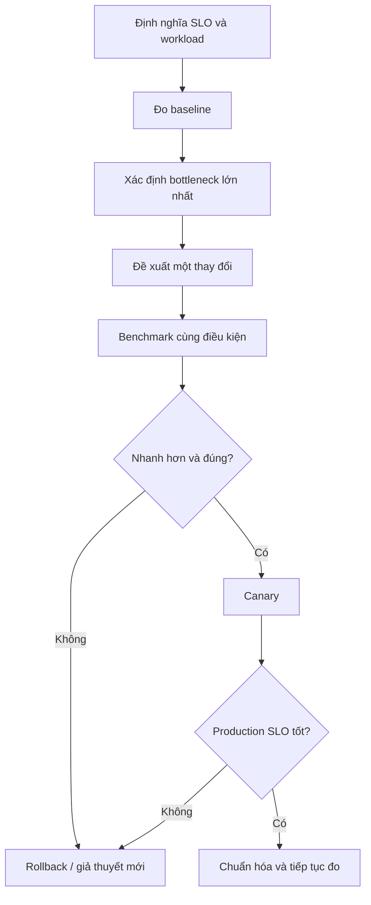

Tối ưu hiệu năng Docker không phải danh sách daemon flags. Container thêm các boundary về image, storage, network và cgroup, nhưng bottleneck thường vẫn nằm trong application, runtime, database hoặc dependency.

Mục tiêu phải đo được, ví dụ:

- giảm p99 từ 400 ms xuống dưới 250 ms ở 800 requests/s;
- giảm startup từ 20 s xuống 8 s;
- tăng batch throughput 30% trong cùng CPU budget;
- giảm memory peak mà không tăng error/GC pause;
- giảm cost mỗi 1.000 jobs nhưng giữ correctness.

## Quy trình bottleneck-first



Bắt đầu từ [Theo dõi tài nguyên](/docs/tai-nguyen-va-hieu-nang/resource-monitoring/) và [Profiling hiệu năng](/docs/tai-nguyen-va-hieu-nang/performance-profiling/), không từ việc đổi ngẫu nhiên limit.

## Baseline phải tái lập

Ghi lại:

```bash
docker version
docker info --format \
  'Driver={{.Driver}} Cgroup={{.CgroupVersion}} CPUs={{.NCPU}} Memory={{.MemTotal}}'
docker image inspect IMAGE --format \
  'id={{.Id}} size={{.Size}} platform={{.Os}}/{{.Architecture}}'
docker inspect CONTAINER --format '{{json .HostConfig}}' > host-config.json
docker stats --no-stream CONTAINER
```

Cùng với:

- image digest và source revision;
- host/VM type, CPU topology và storage;
- request mix/dataset/concurrency;
- warm-up, test duration và số lần lặp;
- dependency versions/location;
- latency distribution, throughput, errors và cost;
- profiler/metrics trong time window.

Không benchmark trên Docker Desktop rồi dùng con số làm capacity contract cho Linux production.

## CPU: giảm work trước khi tăng quota

Kiểm tra theo thứ tự:

1. CPU có thực sự saturated không?
2. Cgroup có bị throttle không?
3. Workload có single-thread/lock-bound không?
4. GC/serialization/compression/encryption chiếm bao nhiêu?
5. Worker count có vượt useful parallelism không?
6. Host có steal time, run queue hoặc noisy neighbor không?

Các hướng tối ưu:

- sửa hot path/algorithm và cache kết quả đúng chỗ;
- batch/vectorize để giảm overhead mỗi item;
- giảm logging/serialization không cần thiết;
- chỉnh worker pool theo CPU budget;
- nới `--cpus` nếu profile chứng minh quota là bottleneck;
- scale out nếu workload parallel theo instance và dependency chịu được;
- chỉ dùng cpuset/NUMA tuning sau benchmark topology thật.

CPU shares không phải hard limit; pin core không tự làm code nhanh hơn. Đọc [CPU limits và reservations](/docs/tai-nguyen-va-hieu-nang/cpu-limits/).

## Memory: giảm retention và pressure

Tối ưu memory không chỉ là hạ `--memory`:

- đặt heap/cache/worker budget explicit;
- giới hạn queue và dùng backpressure;
- stream dữ liệu thay vì buffer toàn bộ;
- giảm allocation churn/object retention;
- chọn batch size theo memory và throughput;
- sửa thread/goroutine/process leak;
- kiểm tra tmpfs, page cache và memory-mapped files;
- cân nhắc swap dựa trên latency benchmark.

Hard limit quá sát peak có thể tăng reclaim/GC hoặc OOM. Hard limit quá rộng cho phép leak ảnh hưởng host. Xem [Memory limits và OOM](/docs/tai-nguyen-va-hieu-nang/memory-limits/).

## Storage: chọn đúng data path

| Workload | Hướng ưu tiên |
|---|---|
| Database/WAL | Named/local managed volume phù hợp, filesystem và durability đã test |
| Source code development | Bind mount tiện lợi; chấp nhận/đo filesystem-sharing overhead trên Desktop |
| Ephemeral scratch | tmpfs khi dữ liệu nhỏ/nhạy/không bền và memory budget cho phép |
| High write churn | Tránh writable layer nếu dữ liệu thực sự là state |
| Shared/remote data | Đo network/backend latency, consistency và failure mode |

Các bước:

- map path tới mount/storage driver/device/backend;
- đo latency/IOPS/throughput với I/O pattern thật;
- xem fsync, queue depth, page cache và I/O pressure;
- giảm small random I/O hoặc batch khi application cho phép;
- dùng volume/storage class phù hợp;
- đặt I/O weight/throttle để bảo vệ peer, không để “tăng tốc” workload.

Đọc [Block I/O controls](/docs/tai-nguyen-va-hieu-nang/block-io/) và [Database storage](/docs/storage/database-storage/).

## Network: bỏ hop và copy không cần thiết, nhưng giữ boundary

Kiểm tra:

- DNS lookup và connection establishment;
- keep-alive/connection pool;
- TLS handshake/session reuse;
- bridge/NAT/proxy path;
- MTU, retransmit, packet loss;
- payload size/compression;
- downstream latency và retry amplification.

User-defined bridge thường đủ nhanh cho đa số service. `--network host` có thể bỏ một số network isolation/path nhưng thay đổi security/port semantics và portability; không dùng chỉ vì benchmark micro cho thấy ít overhead hơn.

Tối ưu an toàn thường bắt đầu từ connection reuse, payload, DNS và retry policy trước khi bỏ network namespace.

## Logging và stdout backpressure

Verbose synchronous logging có thể tăng CPU, allocation, lock contention, disk/network I/O và latency. Đồng thời tắt log quá mức làm mất evidence.

- chọn level/sampling theo môi trường;
- log structured nhưng tránh payload lớn/secret;
- cấu hình driver và rotation;
- theo dõi drop/backpressure/collector outage;
- không benchmark với logging khác production mà không ghi rõ;
- tách audit log bắt buộc khỏi debug noise.

Ví dụ rotation tùy logging driver:

```yaml
services:
  api:
    logging:
      driver: local
      options:
        max-size: "10m"
        max-file: "5"
```

Validate driver support và failure semantics. Logging async có thể mất log khi crash; đây là correctness/operations trade-off.

## Image size, startup và runtime performance

Image nhỏ thường giúp pull/distribution và giảm attack surface, nhưng không tự làm request path nhanh hơn. Tách:

| Metric | Yếu tố chính |
|---|---|
| Pull time | Compressed layer size, registry/network, cache |
| Extract/start time | Layer count/content, snapshotter/storage, entrypoint init |
| Ready time | Application initialization, migration, JIT, dependency warm-up |
| Runtime throughput | Code/runtime/CPU/memory/I/O/network |

Dùng multi-stage build, `.dockerignore`, base image phù hợp và cache layer. Không chọn `scratch` nếu thiếu CA/timezone/library làm application sai.

Xem [Multi-stage builds](/docs/images-va-dockerfile/multi-stage-builds/) và [Image layers và cache](/docs/images-va-dockerfile/layers-and-cache/).

## Container density và host headroom

Nhồi nhiều container hơn không đồng nghĩa cost tốt hơn nếu contention làm tail latency, retry và OOM tăng. Capacity plan cần:

- tổng requests/reservations/limits theo host;
- daemon, kernel, logging và monitoring overhead;
- failure/restart spike;
- deployment overlap khi old/new containers cùng chạy;
- page cache và storage/network limits;
- anti-affinity/failure domain;
- headroom cho incident và host maintenance.

Nếu mọi container có hard memory limit nhưng tổng limits vượt xa host RAM, host vẫn có thể chịu pressure khi nhiều workload peak cùng lúc.

## Runtime configuration mẫu để kiểm chứng

Không có baseline phù hợp mọi application, nhưng config nên explicit và đo được:

```yaml
services:
  api:
    image: registry.example.com/shop/api@sha256:...
    init: true
    cpus: 1.0
    mem_limit: 512m
    mem_reservation: 384m
    pids_limit: 256
    ulimits:
      nofile:
        soft: 4096
        hard: 8192
```

Sau deploy:

```bash
docker compose config
docker compose up --detach --wait
docker compose ps --quiet api | xargs docker inspect --format '{{json .HostConfig}}'
docker stats --no-stream "$(docker compose ps --quiet api)"
```

Các con số trên chỉ là syntax example. Load test để chọn giá trị thật.

## Benchmark checklist

- [ ] Correctness test vẫn pass.
- [ ] Cùng request mix/dataset và dependency state.
- [ ] Warm-up được tách khỏi steady state.
- [ ] Chạy nhiều lần và báo variance.
- [ ] Load generator còn headroom.
- [ ] Cùng image platform, limits, cpuset và host class.
- [ ] Đo p95/p99, throughput, errors, CPU, memory, I/O và network.
- [ ] Không đổi nhiều biến trong một experiment.
- [ ] Có baseline không profiler nếu profiler không chạy production.
- [ ] Tính cả startup, failure/retry và recovery nếu liên quan SLO.

## Rollout và rollback

1. Lưu baseline dashboard/profile và desired config.
2. Deploy một canary/nhóm nhỏ.
3. So sánh cùng traffic class và time window đủ dài.
4. Guardrail: error, latency, OOM, throttling, restart và dependency load.
5. Rollback tự động/thủ công khi vượt threshold.
6. Chỉ mở rộng rollout khi kết quả ổn định.
7. Ghi lại trade-off và xóa emergency tuning drift.

Một thay đổi giảm average latency nhưng tăng p99 hoặc error rate không phải tối ưu thành công.

## Anti-pattern

- Tăng mọi limit mà không profile bottleneck.
- Gọi resource limit là performance tuning; limit chủ yếu governance/isolation.
- Dùng `--privileged`, host network hoặc host PID để “nhanh hơn” mà bỏ threat model.
- Chuyển database state vào writable layer.
- Tắt fsync/durability/checksum để thắng benchmark mà không ghi mất mát dữ liệu.
- So sánh khác host, khác dataset hoặc khác warm-up.
- Chỉ tối ưu image size rồi tuyên bố runtime nhanh hơn.
- Benchmark average, bỏ tail latency/error/correctness.
- Thay config trực tiếp bằng `docker update` rồi quên deployment source.

## Nguồn chính thức

- [Resource constraints — Docker Docs](https://docs.docker.com/engine/containers/resource_constraints/)
- [Runtime metrics — Docker Docs](https://docs.docker.com/engine/containers/runmetrics/)
- [Dockerfile best practices](https://docs.docker.com/build/building/best-practices/)
- [Use Compose in production](https://docs.docker.com/compose/how-tos/production/)
