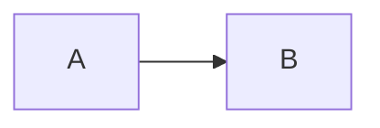

# Content authoring workflow

This page covers repository-specific MDX work under `content/docs/`. The published curriculum is Vietnamese; this Harness Wiki remains English so future agents can use it as repository orientation.

## Read before writing

1. Follow the rule-loading process in [`../quickstart.md`](../quickstart.md).
2. Read the target section's `meta.json` and `index.mdx`.
3. Read neighboring pages—prefer completed pages in the same or preceding section—to match terminology, assumed knowledge, and link style.
4. Read `.agents/skills/write-docs/SKILL.md` and only the relevant files under `.agents/skills/write-docs/references/`.
5. Check recent history for the target section with `git log -- content/docs/<section>` when intent or removed topics are unclear.
6. Check `git status` and preserve unrelated local edits. During this wiki initialization, `content/docs/index.mdx` already contains uncommitted work.

Repository source takes precedence over generic examples in the authoring skill. Some skill references describe related repositories, older dependency versions, or a `dist/` output; Docker Learn currently uses the versions in `package.json` and exports to `out/`.

## Page contract

Every page is an `.mdx` file with standard Fumadocs frontmatter:

```mdx
---
title: "Tên chủ đề"
description: "Mô tả cụ thể phạm vi và giá trị của trang"
---

## Phần đầu tiên

Nội dung tài liệu...
```

`source.config.ts` applies Fumadocs' `pageSchema`, and `src/app/docs/[[...slug]]/page.tsx` renders the frontmatter title and description above the MDX body. Existing substantive pages therefore begin body structure at `##`; do not add a duplicate H1 merely because a generic template contains one.

Descriptions should identify the page's real scope and value. Placeholder wording such as “khung tài liệu ... bổ sung sau” marks unfinished work and should be replaced when the body is completed.

## Adding or completing a page

### Complete an existing placeholder

1. Keep the existing filename unless the planned route is wrong.
2. Replace placeholder description text with an accurate one-line summary.
3. Write the body in Vietnamese, preserving exact commands, identifiers, file paths, and established technical terms.
4. Confirm the page still appears in the correct location in the section's `meta.json`.
5. Add links to prerequisites and next steps without duplicating their explanations.
6. Validate commands and diagrams, then run the checks below.

### Add a new page

1. Choose an existing section when the topic fits its domain; do not create a category merely for one thin page.
2. Create `content/docs/<section>/<slug>.mdx` with required frontmatter.
3. Add `<slug>`—without `.mdx`—to `content/docs/<section>/meta.json` at the intended learning position.
4. If a genuinely new section is required, create its `meta.json` and add the directory slug to `content/docs/meta.json` at the correct curriculum position.
5. Update relevant section indexes and inbound/outbound links.
6. Run metadata, type, and build checks.

### Rename or remove a page

Treat the slug as a public interface. In one change:

- rename/remove the MDX file;
- update its section `meta.json`;
- search `content/docs/` for old route and relative-link references;
- consider whether external compatibility or a redirect is required (the current static app has no content redirect system);
- verify per-page Markdown and OG image outputs as well as the browser route.

## MDX conventions that affect rendering

### Links

Use final-slash documentation routes:

```md
[Xem Buildx](/docs/buildkit/buildx/)
```

`next.config.mjs` enables `trailingSlash: true`. Fumadocs also receives `createRelativeLink(source, page)` for relative MDX links, but explicit `/docs/.../` links are easier to audit across renames.

### Heading hierarchy

The application supplies the page title, so content generally starts at `##` and nests without skipping levels (`##` → `###` → `####`). Headings feed the Fumadocs table of contents.

### Code and tables

- Give every fenced block a language such as `bash`, `dockerfile`, `yaml`, `json`, `text`, or `mermaid`.
- Keep blank lines around tables and JSX blocks.
- Distinguish commands from expected output.
- For destructive Docker commands, state the impact and scope before the command.

### Callouts and components

`src/components/mdx.tsx` spreads Fumadocs' default MDX components and adds `Mermaid`. Completed lessons use Fumadocs JSX such as `<Callout>` for highlighted information. GitHub-style admonitions such as `> [!IMPORTANT]` are not transformed by the current `source.config.ts`; they render as literal blockquote text, so use `<Callout>` instead. Keep blank lines around JSX components.

Do not assume a component mentioned in a reusable skill reference is registered separately in this repository. Verify against `src/components/mdx.tsx` and the installed Fumadocs version.

### Mermaid

Use an unindented fenced block:

````md

````

The build transform and runtime renderer are described in [`../architecture/routes-and-interfaces.md`](../architecture/routes-and-interfaces.md). Test diagrams in light and dark themes. Invalid diagrams should expose the renderer's fallback rather than being accepted based only on MDX compilation.

## Content quality expectations

A substantive lesson should answer:

- What problem does this topic solve?
- Why does the reader need it at this point in the curriculum?
- What is the correct mental model?
- How can the reader verify behavior with a practical example?
- What failure modes, security boundaries, or data-loss risks matter?
- How should the exercise be cleaned up?
- Which official or canonical sources support version-sensitive claims?

Use tables and diagrams when they clarify decisions or flow; do not add them mechanically. Avoid repeating generic Docker introductions in advanced sections. Cross-link the canonical earlier lesson instead.

## Validation

At minimum:

```bash
npm run types:check
npm run build
```

For a broader change, also run:

```bash
npm run lint
```

Then inspect the changed page through `npm run dev` or `npm run preview` and verify:

- sidebar placement and title;
- table of contents hierarchy;
- internal links and trailing slashes;
- code block formatting;
- callouts and custom components;
- Mermaid diagrams in both themes;
- copy/view-as-Markdown action;
- representative search queries when titles or terminology changed.

There is no automated lesson-command test suite. The author or reviewer must validate runnable examples in an appropriate disposable environment and avoid treating a successful site build as proof that Docker commands are correct.
